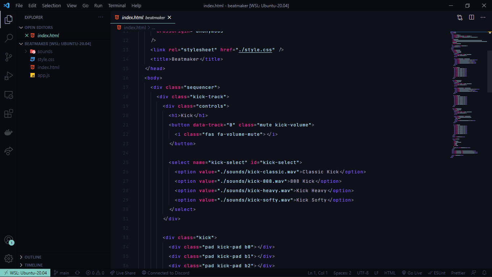
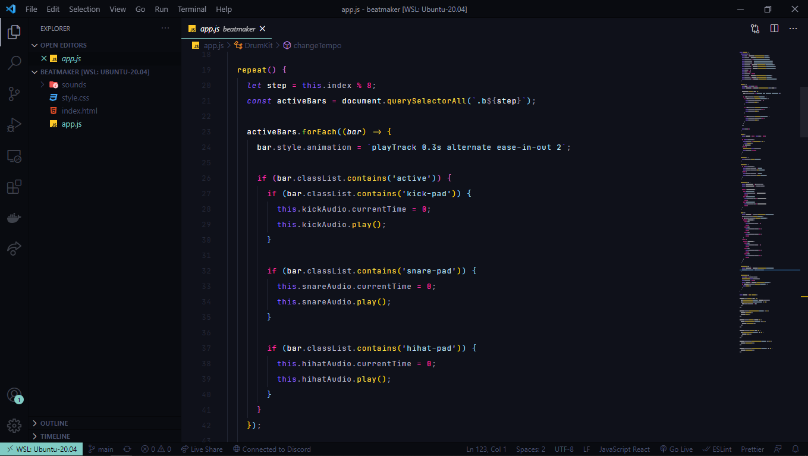

# Negative Alternate Theme

Versão 2.0 do [Negative Theme](https://marketplace.visualstudio.com/items?itemName=Negative.negative-theme)

---

HTML

JavaScript

## Instalação

1. Abrir o **Extensions** sidebar panel no VS Code. `View → Extensions`
2. Procurar por `Negative Alternate`
3. Clicar em **Install**
4. Clicar em **Reload**
5. Ir em Code > Preferences > Color Theme > **Negative Alternate**
